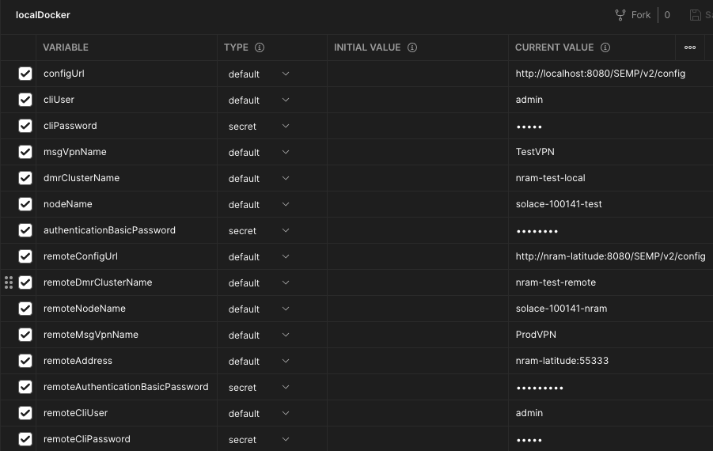
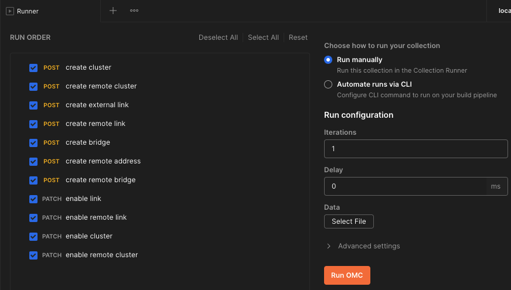
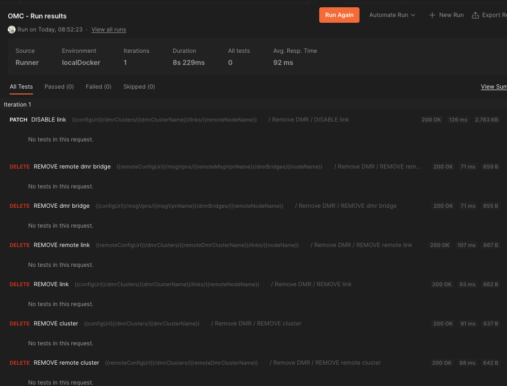

# About

Postman collection to setup and remove DMR cluster, links, etc.

## Usage

### Config

All the required inputs are to be populated in the environment file.

**Sample Environemnt**
[]

### Running

The playbooks can be run individually or as folder (to run all playbooks in sequence) as shown below.

[]

Sample Run - Remove

[]

